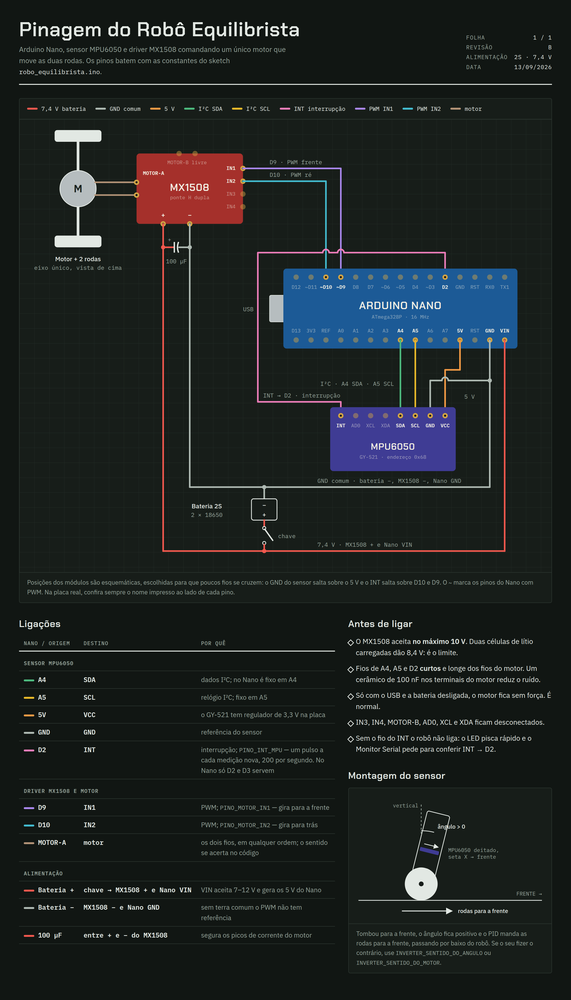
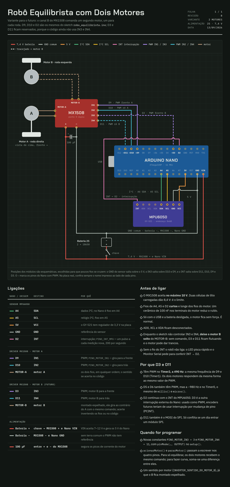

# Robô equilibrista — Arduino Nano

Robô de duas rodas que se equilibra sozinho. As duas rodas são movidas por um
**único motor**, então o robô só anda para a frente e para trás, sem curvas.
Para se equilibrar, isso basta.

O código está em [`robo_equilibrista/robo_equilibrista.ino`](robo_equilibrista/robo_equilibrista.ino).
Não precisa instalar nenhuma biblioteca.

## Peças

| Peça | Função |
|---|---|
| Arduino Nano (ATmega328P) | controlador |
| MPU6050 (módulo GY-521) | acelerômetro + giroscópio |
| MX1508 | driver do motor (2–10 V, ~1,5 A por canal) |
| Motor DC com eixo duplo (ex.: TT amarelo) + 2 rodas | movimento |
| 2 baterias 18650 em série (7,4 V) + suporte | alimentação |
| Chave liga/desliga | — |
| Capacitor eletrolítico 100 µF (recomendado) | segura picos do motor |

## Pinagem

Desenhos completos, com as cores dos fios e a tabela de ligações, na pasta [`docs/`](docs):

| Desenho | Imagem escura | Imagem clara | Página |
|---|---|---|---|
| **Montagem atual**: um motor movendo as duas rodas | [`pinagem-escuro.png`](docs/pinagem-escuro.png) | [`pinagem.png`](docs/pinagem.png) | [escura](docs/pinagem-escuro.html) · [tema do sistema](docs/pinagem.html) |
| **Variante com dois motores**: um motor por roda, no canal B do MX1508 (D3 → IN3, D11 → IN4) | [`pinagem-dois-motores-escuro.png`](docs/pinagem-dois-motores-escuro.png) | [`pinagem-dois-motores.png`](docs/pinagem-dois-motores.png) | [escura](docs/pinagem-dois-motores-escuro.html) · [tema do sistema](docs/pinagem-dois-motores.html) |

As imagens abrem direto no GitHub. As páginas HTML precisam ser baixadas e abertas
no navegador: a versão `-escuro` fica sempre escura; a outra acompanha o tema do sistema.

<details>
<summary>Ver a montagem atual</summary>



</details>

<details>
<summary>Ver a variante com dois motores</summary>



</details>

Os originais são estas páginas, privadas, de onde os arquivos foram exportados:
[pinagem](https://claude.ai/code/artifact/c9c3ca1e-51b2-4fb4-a12d-735298f4e193) e
[dois motores](https://claude.ai/code/artifact/767ab2de-841d-4ebf-b2c2-aa8b2ba5770f).
Se um deles mudar, exporte de novo para `docs/`.

```
 BATERIA 2S (7,4 V)
   (+) ──[ CHAVE ]──┬───────────────────────────── MX1508  +
                    └───────────────────────────── Nano    VIN
   (−) ─────────────┬───────────────────────────── MX1508  −
                    └───────────────────────────── Nano    GND

 ARDUINO NANO                  MX1508                     MOTOR
 ┌───────────┐                ┌───────────────┐          ┌─────────┐
 │        D9 ├───────────────►│ IN1   MOTOR-A ├──────────┤    M    │
 │       D10 ├───────────────►│ IN2   MOTOR-A ├──────────┤ 2 rodas │
 │           │                │ IN3  (livre)  │          └─────────┘
 │           │                │ IN4  (livre)  │
 │           │                └───────────────┘
 │           │
 │           │                 MPU6050 (GY-521)
 │           │                ┌───────────────┐
 │        5V ├────────────────┤ VCC           │
 │       GND ├────────────────┤ GND           │
 │        A5 ├────────────────┤ SCL           │
 │        A4 ├────────────────┤ SDA           │
 │        D2 │◄───────────────┤ INT           │
 └───────────┘                │ XDA XCL AD0  (livres)
                              └───────────────┘
```

| De | Para | Observação |
|---|---|---|
| Nano **A4** | MPU6050 **SDA** | I2C dados (fixo no Nano) |
| Nano **A5** | MPU6050 **SCL** | I2C relógio (fixo no Nano) |
| Nano **5V** | MPU6050 **VCC** | o GY-521 tem regulador próprio |
| Nano **GND** | MPU6050 **GND** | |
| Nano **D2** | MPU6050 **INT** | interrupção: avisa cada medição nova |
| Nano **D9** | MX1508 **IN1** | PWM — frente |
| Nano **D10** | MX1508 **IN2** | PWM — ré |
| MX1508 **MOTOR-A** | motor | os dois fios, em qualquer ordem |
| Bateria **+** (pela chave) | MX1508 **+** e Nano **VIN** | máx. 10 V no MX1508 |
| Bateria **−** | MX1508 **−** e Nano **GND** | **terra comum é obrigatório** |

Cuidados:

- O MX1508 aguenta **no máximo 10 V**: 2 células de lítio (8,4 V carregadas) é o limite.
- Solde o capacitor de 100 µF entre **+** e **−** do MX1508, o mais perto possível.
  Um capacitor cerâmico de 100 nF direto nos terminais do motor também ajuda
  a reduzir o ruído que chega ao MPU6050.
- Use fios curtos no I2C (A4/A5) e no INT (D2), e passe-os longe dos fios do motor.
- Com o USB ligado e a bateria desligada, o motor não tem força — normal.

### Por que o INT vai no D2

O MPU6050 mede 200 vezes por segundo e, a cada medição, dá um pulso no pino
**INT**. O Nano recebe esse pulso como **interrupção** e só então lê o sensor e
roda o PID. Assim cada ciclo usa uma medição nova (nem repetida, nem atrasada)
e o tempo usado nas contas é o intervalo real entre as medições.

No Nano, só **D2** e **D3** têm interrupção externa; o código usa o D2
(`PINO_INT_MPU`). Se os avisos pararem de chegar por 50 ms (fio solto, por
exemplo), o motor é desligado.

## Montagem do sensor

- Módulo **deitado** (na horizontal), preso firme (sem folga, sem espuma).
- O mais perto possível do **eixo das rodas** e centralizado.
- A seta **X** impressa na placa aponta para a **frente** do robô.

Convenção usada no código:

- ângulo **positivo** = robô tombando para a frente;
- comando **positivo** = rodas indo para a frente.

## Primeiro uso

1. Grave o código, abra o **Monitor Serial** a 115200 baud com final de linha
   **"Nova linha"**.
2. Ao ligar, deixe o robô **parado por 2 s** (o LED pisca): é a calibração do giroscópio.
3. **Confira o sentido do ângulo.** Incline o robô para a frente: `angulo` deve
   ficar positivo. Se ficar negativo, mude `INVERTER_SENTIDO_DO_ANGULO` para `true`.
4. **Confira o sentido do motor.** Segure o robô no ar, em pé, e incline um pouco
   para a frente: as rodas devem girar **para a frente** (na direção da queda).
   Se girarem para trás, mude `INVERTER_SENTIDO_DO_MOTOR` para `true`
   (ou inverta os fios do motor).
5. **Ache o ponto de equilíbrio.** Segure o robô na posição em que ele quase se
   equilibra sozinho e mande `marcar_equilibrio`.
6. **Ache o PWM mínimo.** Mande `kp 5`, `kd 0` e `pwm_minimo 0`. Segure o robô
   inclinado com a mão e vá subindo (`pwm_minimo 30`, `pwm_minimo 40`, …) até o
   menor valor em que a roda realmente gira. Volte os ganhos depois.

## Ajuste do PID

Comandos pelo Monitor Serial:

| Comando | Faz |
|---|---|
| `kp 20` | muda o ganho proporcional |
| `ki 40` | muda o ganho integral |
| `kd 0.8` | muda o ganho derivativo |
| `angulo_equilibrio -1.5` | muda o ângulo em que o robô fica em pé |
| `marcar_equilibrio` | usa o ângulo atual como ângulo de equilíbrio |
| `pwm_minimo 40` | muda o menor PWM que faz o motor girar |
| `angulo_queda 35` | muda a inclinação (5 a 80°) a partir da qual o robô "caiu" e o motor desliga |
| `peso_giroscopio 0.98` | muda quanto o filtro confia no giroscópio (0 a 1); veja abaixo |
| `divisor_amostragem 4` | muda quantas medições por segundo o MPU6050 faz: 1000 / (1 + divisor) (1 a 19) |
| `filtro_passa_baixas 3` | muda o filtro interno do MPU6050: 1 = 188 Hz … 6 = 5 Hz (1 a 6) |
| `escala_acelerometro 2` | muda a faixa do acelerômetro: ±2, ±4, ±8 ou ±16 g (outros valores vão para a mais próxima) |
| `telemetria` | liga/desliga o envio de números para o computador |
| `valores` | mostra os valores atuais |
| `ajuda` | mostra a lista de comandos |

Maiúsculas e minúsculas tanto faz (`KP 20` também funciona).

A telemetria sai no formato
`angulo:…,angulo_equilibrio:…,termo_P:…,termo_I:…,termo_D:…,comando_motor:…`
e pode ser vista como gráfico no **Plotter Serial** da IDE.

**`peso_giroscopio`** decide a mistura do filtro complementar. Com 0,98, o
acelerômetro corrige o ângulo em cerca de 0,25 s (`5 ms × 0,98 / 0,02`). Valores
menores (0,95) corrigem mais rápido o escorregamento do giroscópio, mas deixam os
trancos do motor aparecerem no ângulo; valores maiores (0,995) deixam o ângulo mais
liso, mas demoram mais para corrigir. Em 1, o ângulo escorrega até o robô cair.

**`divisor_amostragem`** e **`filtro_passa_baixas`** vão direto para os
registradores do MPU6050, sem regravar o sketch:

| `divisor_amostragem` | Medições por segundo | Intervalo |
|---|---|---|
| 1 | 500 | 2 ms |
| 4 (padrão) | 200 | 5 ms |
| 9 | 100 | 10 ms |
| 19 | 50 | 20 ms |

| `filtro_passa_baixas` | Corta vibrações acima de | Atraso na leitura |
|---|---|---|
| 1 | 188 Hz | 1,9 ms |
| 2 | 98 Hz | 2,8 ms |
| 3 (padrão) | 42 Hz | 4,8 ms |
| 4 | 20 Hz | 8,3 ms |
| 5 | 10 Hz | 13,4 ms |
| 6 | 5 Hz | 18,6 ms |

Motor zumbindo e termo D tremendo: suba o filtro. Robô atrasado, oscilando mesmo
com Kd alto: desça. O divisor também muda a velocidade do filtro complementar,
porque o `peso_giroscopio` é aplicado a cada medição. Quando o Nano reinicia,
os dois voltam aos valores escritos no sketch; o `pid-robot` reaplica os do último envio.

**`escala_acelerometro`** não muda nenhuma conta (o ângulo usa só a proporção entre os
eixos): decide a resolução e a partir de quantos g o sensor satura. ±2 g é o mais fino;
±4 g aguenta melhor batidas e trancos.

**`angulo_queda`** é a margem de segurança: baixo demais, o robô desiste de
inclinações que ainda dava para salvar; alto demais, o motor fica girando com ele
deitado no chão.

Roteiro:

1. Comece com `ki 0` e `kd 0`.
2. Suba o **Kp** até o robô reagir forte e começar a **oscilar** para a frente e para trás.
3. Suba o **Kd** até a oscilação sumir. Se o motor começar a zumbir ou vibrar, passou do ponto.
4. Se ainda sobrar tremor, reduza um pouco o Kp (uns 10–20%).
5. Se o robô fica em pé mas vai **andando** para um lado até cair, ajuste primeiro
   o ângulo de equilíbrio (`marcar_equilibrio` ou `angulo_equilibrio`) e só depois acrescente um **Ki** pequeno.

Os valores enviados se perdem quando o Nano desliga ou reinicia: quando achar bons
valores, copie-os para o início do código (`Kp`, `Ki`, `Kd`, `anguloDeEquilibrio`, `pwmMinimo`).

### Interface `pid-robot`

Em vez de digitar os comandos no Monitor Serial, use a interface de terminal
[`ferramentas/pid-robot`](ferramentas/pid-robot) (Python 3, sem dependências):

```bash
pid-robot                        # usa a última porta ou a primeira /dev/ttyUSB* ou /dev/ttyACM*
pid-robot --porta /dev/ttyUSB0
```

| Tecla | Faz |
|---|---|
| `↑` `↓` | escolhe o parâmetro |
| `←` `→` | ajusta com o passo normal |
| `+` `-` | ajusta com um décimo do passo (os inteiros andam de 1 em 1) |
| `PgUp` `PgDn` | ajusta com 10 vezes o passo |
| `0`–`9` | digita um valor (`-` troca o sinal); `Enter` confirma e envia |
| `Enter` | envia o parâmetro selecionado |
| `e` | envia todos |
| `u` | descarta alterações e volta ao último envio |
| `a` | liga/desliga o envio automático a cada ajuste |
| `m` | marca o ângulo atual como equilíbrio |
| `t` | liga/desliga a telemetria do robô |
| `c` | libera a porta (para gravar o sketch pela IDE) e conecta de novo |
| `q` / `Esc` | sai |

- Cada parâmetro mostra se está **não enviado**, **enviado** ou **confirmado no robô**.
- Embaixo da tabela, o parâmetro selecionado ganha uma descrição detalhada: o que ele faz,
  o que acontece ao aumentar ou diminuir e como ajustar, com os números recalculados para o
  valor na tela. A tela se ajusta à altura do terminal; com menos de ~32 linhas, parte da
  descrição fica escondida.
- Mostra ao vivo o ângulo, o comando do motor e os termos P, I e D.
- O último envio fica guardado em `~/.config/pid-robot/ultimo-envio.json` e volta
  ao abrir o programa. Como o Nano reinicia quando a porta é aberta (e volta aos
  valores do código), o `pid-robot` reaplica o último envio assim que o robô termina
  de calibrar.
- Ao sair, imprime os valores prontos para colar no início do sketch.
- Feche o Monitor Serial da IDE antes: os dois não podem usar a porta ao mesmo tempo.

Para chamar `pid-robot` de qualquer lugar, há um link simbólico em
`~/repos/scripts` (que já está no `PATH`):

```bash
ln -s "$PWD/ferramentas/pid-robot" ~/repos/scripts/pid-robot
```

## Problemas comuns

| Sintoma | Causa provável |
|---|---|
| LED piscando rápido sem parar | MPU6050 não responde: confira VCC, GND, A4, A5 e INT → D2 (a mensagem no Monitor Serial diz qual) |
| "Falha: o MPU6050 parou de avisar pelo INT" | fio do INT (D2) com mau contato |
| Rodas fogem da queda e o robô cai na hora | sentido do motor ou do ângulo invertido |
| Ângulo "escorrega" com o robô parado | robô se mexeu durante a calibração: reinicie parado |
| Arduino reinicia quando o motor acelera | bateria fraca, falta do capacitor ou terra mal ligado |
| Ângulo pula muito quando o motor liga | ruído/vibração: fixe melhor o sensor, afaste os fios, use os capacitores |
